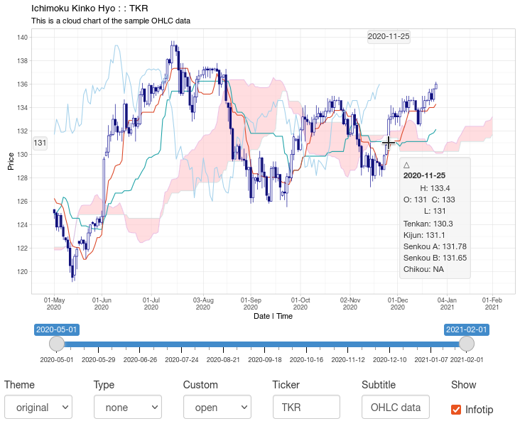

```{r index, echo=FALSE}

photos <- file.path("_images", list.files("_images"))
develop <- function(x) {
  plot(imager::load.image(x), axes = FALSE)
  paste0(openssl::sha256(file(x)))
}
par(mar = c(0, 0, 0, 0))
data.frame(sha256 = develop(photos))

```
<aside> Shikokuchuo </aside>

An implementation in R of the Ichimoku Kinkō Hyō (一目均衡表) charting system, also commonly known as 'cloud charts'.

The technique is a refinement on candlestick charting originating from Japan, now in widespread use in technical analysis worldwide. Translating to 'one-glance equilibrium chart', it allows the price action and market structure of financial securities to be determined 'at-a-glance'.

### Example

Load package and sample data:

```{r setup}
library(ichimoku)
TKR <- sample_ohlc_data
```

`ichimoku()` to generate the ichimoku object:

```{r ichimoku}
cloud <- ichimoku(TKR)
```

`iplot()` for fully-interactive cloud charts:

```{r iplot, eval=FALSE}
iplot(cloud)
```


`plot()` for production-quality static cloud charts:

```{r plot}
plot(cloud, window = "2020-04/", theme = "solarized")
plot(cloud, window = "2020-04/", theme = "dark")
plot(cloud, window = "2020-04/", theme = "mono")
```

### Installation

Install the released version of ichimoku from CRAN:

``` r
install.packages("ichimoku")
```

Or the latest development version from rOpenSci R-universe binaries:

``` r
install.packages("ichimoku", repos = "https://shikokuchuo.r-universe.dev")
```

Or the latest development version from the Github source:

``` r
devtools::install_github("shikokuchuo/ichimoku")
```

### Package site

Hosted ourselves at: <https://shikokuchuo.net/ichimoku/>
^[Gao, C. (2021), *ichimoku: Visualization and Tools for Ichimoku Kinko Hyo Strategies*. R package version 1.0.0, <https://CRAN.R-project.org/package=ichimoku>.]

### Ichimoku Kinko Hyo ^[Sasaki, H. 佐々木 英信 (1996), *一目均衡表の研究 [ichimoku kinkouhyou no kenkyuu]*. Tokyo, Japan: Toushi Radar.]

The system consists of the following chart lines added to a candlestick chart:

1. 転換線 **Tenkan-sen** [conversion line]: the mid-point of the highest high and lowest low for the past 9 periods *(including the current period)*

2. 基準線 **Kijun-sen** [base line]: the mid-point of the highest high and lowest low for the past 26 periods *(including the current period)*

3. 先行スパン1 **Senkou span A** [leading span A]: the mid-point of Tenkan-sen and Kijun-sen plotted ahead 26 periods *(including the current period)*

4. 先行スパン2 **Senkou span B** [leading span B]: the mid-point of the highest high and lowest low for the past 52 periods *(including the current period)*, plotted ahead 26 periods *(including the current period)*

5. 遅行スパン **Chikou span** [lagging span]: the current period closing price plotted behind 26 periods *(including the current period)*

The 雲 **kumo** [cloud] is the area bounded by Senkou span A and Senkou span B (usually shaded on a chart).

### Interpretation

Ichimoku Kinkō Hyō can be translated as ‘one-glance equilibrium chart’. It is designed to allow the price action and market structure of financial securities to be determined ‘at-a-glance’ in a highly visual fashion.

For example in a strongly upwards-trending market, the candlesticks will be above the Tenkan-sen, which will be above the Kijun-sen, which will be above the cloud, and the Chikou span may not have anything above it.

The lines and the cloud represent dynamic support and resistance zones relative to the price candles. Generally the thicker the cloud, the tougher the support/resistance. In our previous example, if the price now reverts downwards, it can expect support first at the Kijun-sen, then the Tenkan-sen and finally the cloud itself.

More subtle interpretations involve the Chikou span in particular and its action in relation to the cloud lines as well as the candles.

### Context

Ichimoku analysis is the latest refinement in candlestick charting techniques, which also originated from Japan back in the 18th century. Developed earlier in the 20th century by 一目山人 *Ichimoku, Sanjin*, the pen name of 細田吾一 *Hosoda, Goichi*, his work was finally published in 1969 as the seminal *「一目均衡表」 [ichimoku kinkou hyou]*. It gained popularity especially after the publication of Sasaki’s *「一目均衡表の研究」 [ichimoku kinkouhyou no kenkyuu]* in 1996, and is now widely-used in technical analysis worldwide.

The time periods have traditionally been calculated as 9, 26 and 52 based on manual data analysis performed in Japan in a pre-computer age where there was a 6-day working week resulting in 26 average trading days in a month. Although this bears little relevance to the current day, the use of these time periods has persisted as an ‘industry norm’ or ‘accepted practice’.

To use other periods would be meaningless in a sense as everyone uses these parameters and ‘market psychology’ can and often does create its own realities, independent of any fundamentals. However, there is no reason for the technique not to evolve, and to reflect changing trading realities perhaps other parameters will become more relevant in the collective psychology.

Finally, the use originated with daily candlesticks, and the most valid interpretation remains for daily data. However, it is equally used today for both shorter intra-day, e.g. 4-hour or hourly, and longer, e.g. weekly or monthly, charts.

