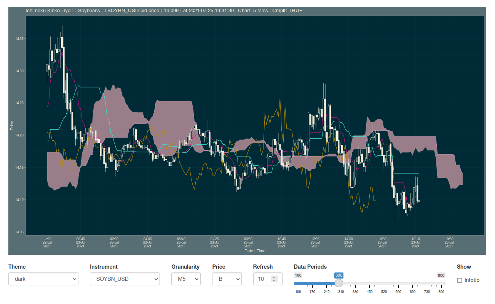

```{r index, echo=FALSE}

photos <- file.path("_images", list.files("_images"))
develop <- function(x) {
  plot(imager::load.image(x), axes = FALSE)
  paste0(openssl::sha256(file(x)))
}
par(mar = c(0, 0, 0, 0))
data.frame(sha256 = develop(photos))

```
<aside> Shikokuchuo </aside>

### About ichimoku

The ichimoku R package^[Gao, C. (2021), *ichimoku: Visualization and Tools for Ichimoku Kinko Hyo Strategies*. R package version 0.3.51. https://shikokuchuo.net/ichimoku/ CRAN page: https://CRAN.R-project.org/package=ichimoku] provides tools for creating and visualising Ichimoku Kinko Hyo (cloud chart) strategies.

It features in the [Empirical Finance CRAN Task View](https://cran.r-project.org/view=Finance), and was selected as one of [RStudio's Top 40 New CRAN Packages](https://rviews.rstudio.com/2021/06/24/may-2021-top-40-new-cran-packages/) for May 2021.

The latest version incorporates an interface to the OANDA fxTrade API^[‘OANDA’ and ‘fxTrade’ are trademarks owned by OANDA Corporation, an entity unaffiliated with the ichimoku package.].

### About the OANDA fxTrade API

OANDA is an authoritative source of foreign exchange data utilised by both governments and global corporations alike. OANDA offers a few APIs, including its rates for business, but the fxTrade API is perhaps the most comprehensive, built upon its retail and professional trading offering of the same name. Access to the fxTrade API is free but requires registration for a practice/demo account.

The API can be used for retrieving historical and live streaming price data for major currencies, metals, commodities, government bonds and stock indices. It is a rich source of financial data with excellent availability, for instance daily OHLC pricing data for major forex pairs from the start of 2005, and data granularity ranging from 5 seconds to monthly.

For the total list of over 120 covered instruments please see [here](https://shikokuchuo.net/ichimoku/articles/xoanda.html#available-instruments).

### Screenshots

*Click on an image to view in full resolution.*

Showcased here is the function `oanda_studio()`, the implementation in R Shiny. As a Shiny app, the function may be called without specifying any parameters; the full range of options can be selected interactively from within the web interface.

Data is live and updates at the specified refresh rate (default of every 5 secs).

The cursor infotip provides an innovative overview of the data directly from the chart (can be turned on or off as desired).

```{r oastudio, eval=FALSE}

library(ichimoku)

oanda_studio()

```

<a href="img/oastudio1.png" target="_blank"></a>

Of course arguments for customisation can also be specified within the call to `oanda_studio()` itself. Demonstrating some further options below with Soybean futures:

```{r oastudiod, eval=FALSE}
oanda_studio("SOYBN_USD", granularity = "M5", refresh = 10, price = "B", theme = "dark")
```

<a href="img/oastudio2.png" target="_blank"></a>

### Other functions

Other functions to access the OANDA fxTrade API are included in the ichimoku package. These are standard R functions for retrieving data in tabular form and charting (not reliant on Shiny), and include:

- [`oanda()`](https://shikokuchuo.net/ichimoku/reference/oanda.html) to retrieve historical price data
- [`oanda_stream()`](https://shikokuchuo.net/ichimoku/reference/oanda_stream.html) for a live streaming data feed
- [`oanda_chart()`](https://shikokuchuo.net/ichimoku/reference/oanda_chart.html) for live updating ichimoku cloud charts

### Links and further information

ichimoku R package site: https://shikokuchuo.net/ichimoku/ 

ichimoku OANDA fxTrade API vignette: https://shikokuchuo.net/ichimoku/articles/xoanda.html

OANDA fxTrade API developer website: https://developer.oanda.com/
