```{r setup, include=FALSE}
knitr::opts_chunk$set(echo = TRUE)
library(mirai)
```


The R ecosystem continues to evolve with powerful tools for modern computing challenges, and **mirai** stands at the forefront of asynchronous evaluation frameworks. This latest release brings significant enhancements that solidify mirai's position as the most sophisticated approach to async computing in R.

### What Makes mirai Unique?

mirai (ミライ, Japanese for "future") represents a paradigm shift in how R handles asynchronous operations. Built on the robust foundation of [nanonext](https://nanonext.r-lib.org) and NNG (Nanomsg Next Gen), mirai offers:

- **True event-driven architecture** with non-polling promises
- **Seamless distributed computing** over modern, scalable and secure networking
- **Support for reference objects** like Arrow Tables and torch tensors
- **Async-first by design**  e.g. async rather than just parallel map

Unlike traditional parallel computing approaches in R, mirai handles many more tasks than available processes (and requires no file system storage) through its inherently queued architecture.

### Key Enhancements in Version 2.3.0

#### 1. Enhanced Timeout Capabilities

The most notable behavioural change is the upgrade to `mirai()`'s `.timeout` argument. mirai now **automatically cancels ongoing operations upon timeout**. This feature provides better control over long-running tasks and prevents resource wastage from abandoned computations.

```r
# Timeout now actively cancels the operation
m <- mirai({
  long_compute_intensive_task()
}, .timeout = 5000)  # Cancels after 5 seconds
```

#### 2. Improved Serialization Configuration

`serial_config()` now accepts **vector arguments** to register multiple custom serialization configurations simultaneously.

This enhancement simplifies working with diverse data types across distributed systems, for example both Arrow Tables and Polars DataFrames.

#### 3. Comprehensive Network Discovery

`host_url()` has been upgraded to return **all local IP addresses**, named by network interface. This provides a more robust solution for distributed computing setups, especially in complex network environments:

```r
# Returns all available interfaces
host_url()
# Example output:
# eth0: "tcp://192.168.1.100:5555"
# wlan0: "tcp://192.168.1.101:5555"
```

#### 4. New Utility Functions

Three new functions enhance the developer experience:

- **`register_serial()`**: allows package authors to register serialization configurations for all `daemons()` calls
- **`on_daemon()`**: indicates whether evaluation is occurring within a mirai call on a daemon
- **`daemons_set()`**: checks if daemons are set for a given compute profile

#### 5. Extended Support for HPC Environments

For HPC environments, `daemons()` now supports initial synchronization exceeding 10 seconds.

This enhancement is particularly valuable for large-scale distributed computing setups where network latency or resource provisioning may require longer connection times.

### Integration with the R Ecosystem

#### Official R Parallel Cluster Type

As of R 4.5, mirai is now one of the **official base R parallel cluster types**.

```r
# Create a miraiCluster directly
cl <- parallel::makeCluster(6, type = "MIRAI")
```

#### Seamless Shiny

mirai's promises integrate seamlessly with Shiny applications, enabling truly responsive user interfaces.
Developed in collaboration with Joe Cheng (creator of Shiny), it's the only event-driven solution that fully integrates with Shiny's capabilities, and also scales to complex apps with many users [Link to vignette examples](https://mirai.r-lib.org/articles/v3-promises.html).

#### Powers Purrr

mirai's `mirai_map()` provides the underlying implementation for purrr's new `purrr::map(.parallel = TRUE)` and friends (currently in the development version). Purrr is one of the core tidyverse packages, and a respected functional programming tookit that is depended upon by data scientists and developers alike.

#### Science at Scale

mirai users benefit from a longstanding collaboration with Will Landau at Eli Lily, where his targets package adopted crew (built on mirai) as its default HPC backend. The life sciences industry runs heavy-duty pipelines across HPC and cloud environments on a constant basis, providing real life assurance of mirai's reliability.

### Getting Started with mirai 2.3.0

Installation is straightforward:

```r
install.packages("mirai")
```

Basic usage remains elegantly simple:

```r
library(mirai)

# Launch background daemons
daemons(6)

# Evaluate asynchronously
m <- mirai({
  expensive_computation()
})

# Continue other work...

# Retrieve result when needed
result <- m$data
```

### Looking Forward

mirai represents more than an incremental improvement — it's a testament to R's evolution as a modern computing platform. With its sophisticated architecture, robust error handling, and seamless integration with contemporary R workflows, mirai enables developers to build scalable, responsive applications that leverage distributed computing resources effectively.

The combination of simplicity in design and power in execution makes mirai the go-to solution for:

- High-performance computing in research environments
- Production-grade Shiny applications requiring responsiveness at scale
- Data engineering pipelines with complex computational requirements
- Machine learning workflows involving large models and datasets

As the R ecosystem continues to modernize, mirai stands as a cornerstone technology, bridging the gap between R's statistical heritage and the demands of contemporary distributed computing.

---

*For more information, visit the [mirai website](https://mirai.r-lib.org/) or explore the package on [CRAN](https://cran.r-project.org/package=mirai) or [GitHub](https://github.com/r-lib/mirai). Join the community in shaping the future of async computing in R.*
