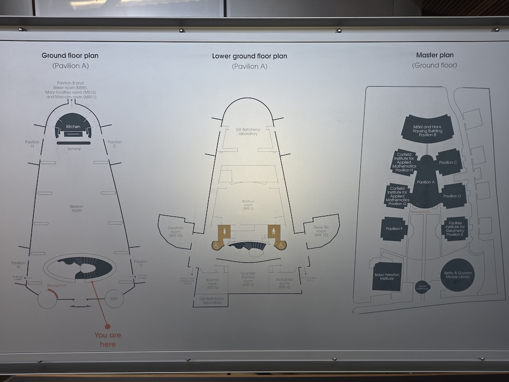

```{r setup, include=FALSE}
knitr::opts_chunk$set(echo = FALSE)
```



### State of Async in the Ecosystem

I gave a talk at Posit Conf last year (2024) on bringing first-class (real, event-driven) async to R, jointly with Will Landau, a long-time collaborator. At the time his crew package was the only practical way to use mirai in High-Performance Computing (HPC) environments, and it continues to be a great solution for HPC and cloud platforms, powering all distributed targets pipelines.

Since then, we at Posit have been delivering this vision to you. First we now have event-driven async in our popular packages httr2 and ellmer. We've also added event-driven file watching capability to auto-reload Shiny in its latest (1.11.0) release. But did you know that the seed for all these capabilities originated with mirai?

mirai is now recognized as a primary async backend for Shiny (in 1.11.0), and we're updating our promises documentation as this post goes to publication to provide additional support for users. It also powers parallel execution in purrr, with a shiny new `in_parallel()` adverb that's in a version on the verge of being released. It's also the async evaluator behind the `@async` tag in plumber2 (still experimental at the posit-dev GitHub organization).

As mirai now underpins much of this ecosystem, it was about time that HPC got first-class treatment within mirai itself. We're really pleased to bring this to you, and we're really excited with what we've been seeing in terms of how efficiently mirai scales.

### What's New: cluster_config() HPC Integration

The headline feature of mirai 2.4.0 is the addition of `cluster_config()`, a flexible launcher designed specifically for HPC environments. This allows R users to easily deploy mirai daemons across HPC clusters using familiar resource management systems.

#### Supported HPC Resource Managers

The new `cluster_config()` supports all major HPC schedulers:

- **Slurm** (using `sbatch`)
- **SGE** (Sun Grid Engine, using `qsub`)
- **Torque/PBS** (using `qsub`)
- **LSF** (Load Sharing Facility, using `bsub`)

#### Simple Yet Powerful Configuration

The beauty of `cluster_config()` lies in its simplicity. With just three parameters, you can configure complex HPC deployments:

```r
cluster_config(
  command = "sbatch",    # The scheduler command
  options = "",          # Scheduler-specific options
  rscript = "Rscript"    # Path to R executable
)
```

### Real-World Examples

Here's how you can use `cluster_config()` with different HPC systems:

#### Slurm Configuration
```r
# Configure for Slurm with resource specifications
slurm_config <- cluster_config(
  command = "sbatch",
  options = "#SBATCH --job-name=mirai
             #SBATCH --mem=10G
             #SBATCH --output=job.out
             module load R/4.5.0",
  rscript = file.path(R.home("bin"), "Rscript")
)

# Launch daemons using the configuration
daemons(
  n = 100,
  url = host_url(),
  remote = slurm_config
)
```

#### SGE Configuration
```r
# Configure for SGE
sge_config <- cluster_config(
  command = "qsub",
  options = "#$ -N mirai
             #$ -l mem_free=10G
             #$ -o job.out
             module load R/4.5.0"
)
```

#### LSF Configuration
```r
# Configure for LSF
lsf_config <- cluster_config(
  command = "bsub",
  options = "#BSUB -J mirai
             #BSUB -M 10000
             #BSUB -o job.out
             module load R/4.5.0"
)
```

### Why This Matters for HPC Users

The introduction of `cluster_config()` represents a significant milestone for R users working in HPC environments. Previously, setting up distributed computing across cluster nodes required manual script writing and configuration. Now, mirai provides a unified R interface that abstracts away the complexity, while maintaining the full power and flexibility of setting any available options.

#### Key Benefits:

1. **Unified Interface**: One function works across all major HPC schedulers
2. **Native Integration**: No need for external scripts or complex setup procedures
3. **Flexible Configuration**: Full access to scheduler-specific options and commands
4. **Seamless Scaling**: Easy deployment from single nodes to hundreds of cores
5. **Resource Management**: Support for memory limits, logging and other requirements

### Additional Enhancements

Beyond the headline `cluster_config()` launcher, version 2.4.0 introduces several important improvements:

#### Developer-Friendly Features

**New `require_daemons()` Function**:

- Provides an elegant way to prompt users to set up daemons when needed, complete with clickable function links (leveraging the cli package where available).

#### Behavioural Improvements

**Enhanced Daemon Management**:

- Daemons now exit immediately when the host process terminates.
- Protection against recursive local daemon spawning during `mirai_map()` operations.

**Simplified Remote Launches**:

- `launch_remote()` commands are now simpler, as daemons retrieve RNG streams directly from the dispatcher rather than requiring a unique `rs` argument. This allows easier manual deployment.

### Getting Started

To take advantage of these new features, update to mirai 2.4.0:

```r
install.packages("mirai")
```

For HPC users, the path to distributed computing with mirai has never been clearer:

```r
library(mirai)

# Configure your HPC environment
config <- cluster_config(
  command = "sbatch",  # or qsub, bsub as appropriate
  options = "your_scheduler_options_here"
)

# Launch distributed daemons
daemons(n = 10, url = host_url(), remote = config)

# Start computing at scale
results <- mirai_map(1:1000, expensive_function)
```

### Looking Forward

We hope that mirai 2.4.0 allows HPC computing to become more accessible to a broader range of R users, democratizing high-performance computing capabilities across the community.

Whether you're processing large datasets, running complex simulations, or conducting extensive model training, mirai 2.4.0's HPC integration provides the tooling you need to scale your R workflows efficiently and elegantly.

The *mirai* of async computing in R is here, and it's more accessible than ever.

---

*Learn more about mirai and its capabilities at the [official documentation](https://mirai.r-lib.org/) or explore the source code on [GitHub](https://github.com/r-lib/mirai).*
